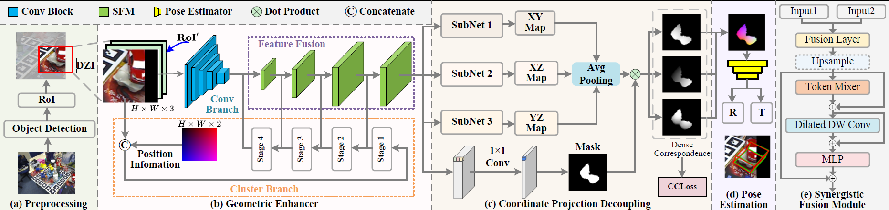

## SynergyPose: Synergy Enhanced Feature and Projection Decoupling for 6D Pose Estimation

This is official implement of  **SynergyPose**. SynergyPose is a RGB-based and single-intermediate-representation-based pose estimation framework.





### Getting startted

#### Prepare the datasets

Please download the 6D pose dataset from the [BOP website](https://bop.felk.cvut.cz/datasets/) and [VOC_2012](https://pjreddie.com/projects/pascal-voc-dataset-mirror/) for background images.

Using the LM-O dataset as an example, the structure of `datasets` folder should look like below:

```bash
datasets/
├── BOP_DATASETS  
    ├──lmo
    	├──models
    	├──model_eval
		├──test
    	├──train
    	├──train_pbr
    	├──test_targets_bop19.json
└──VOCdevkit
```


#### Prepare the environment

```bash
# ubuntu 22.04, cuda 11.6, python3.8

# Creating a virtual Environment
conda create -n sp python=3.8

# Install Pytorch 1.10.0 and torchvision
conda install pytorch==1.10.0 torchvision==0.11.0 torchaudio==0.10.0 cudatoolkit=11.3 -c pytorch -c conda-forge

# Install detectron2
python -m pip install detectron2 -f \
  https://dl.fbaipublicfiles.com/detectron2/wheels/cu113/torch1.10/index.html
  
# Install other dependencies
pip install -r requirements.txt
```


#### Train

`./core/modeling/train.sh "sp_config/config.py" <gpu_ids>`

#### Test

`./core/modeling/test.sh "sp_config/config.py" <gpu_ids> <ckpt_path> `
